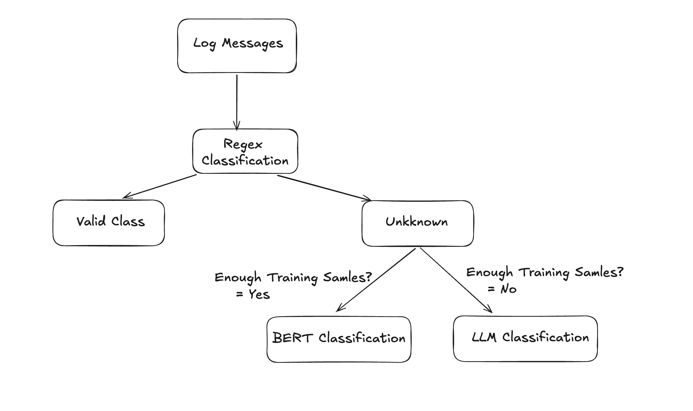

# Log Classification With Hybrid Classification Framework

This project implements a hybrid log classification system, combining three complementary approaches to handle varying levels of complexity in log patterns. The classification methods ensure flexibility and effectiveness in processing predictable, complex, and poorly-labeled data patterns.

---

## Classification Approaches

1. **Regular Expression (Regex)**:
   - Handles the most simplified and predictable patterns.
   - Useful for patterns that are easily captured using predefined rules.

2. **Sentence Transformer + Logistic Regression**:
   - Manages complex patterns when there is sufficient training data.
   - Utilizes embeddings generated by Sentence Transformers and applies Logistic Regression as the classification layer.

3. **LLM (Large Language Models)**:
   - Used for handling complex patterns when sufficient labeled training data is not available.
   - Provides a fallback or complementary approach to the other methods.



---

## Folder Structure

1. **`training/`**:
   - Contains the code for training models using Sentence Transformer and Logistic Regression.
   - Includes the code for regex-based classification.

2. **`models/`**:
   - Stores the saved models, including Sentence Transformer embeddings and the Logistic Regression model.

3. **`resources/`**:
   - This folder contains resource files such as test CSV files, output files, images, etc.

4. **Root Directory**:
   - Contains the FastAPI server code (`server.py`).

---

## Setup Instructions

1. **Install Dependencies**:
   Make sure you have Python installed on your system. Install the required Python libraries by running the following command:

   ```bash
   pip install -r requirements.txt
   ```

2. **Run the FastAPI Server**:
   To start the server, use the following command:

   ```bash
   uvicorn server:app --reload
   ```

   Once the server is running, you can access the API at:
   - `http://127.0.0.1:8000/` (Main endpoint)
   - `http://127.0.0.1:8000/docs` (Interactive Swagger documentation)
   - `http://127.0.0.1:8000/redoc` (Alternative API documentation)

---

## Usage

Upload a CSV file containing logs to the FastAPI endpoint for classification. Ensure the file has the following columns:
- `source`
- `log_message`

The output will be a CSV file with an additional column `target_label`, which represents the classified label for each log entry.


# AWS-CICD-Deployment-with-Github-Actions

## 1. Login to AWS console.

## 2. Create IAM user for deployment

	#with specific access

	1. EC2 access : It is virtual machine

	2. ECR: Elastic Container registry to save your docker image in aws


	#Description: About the deployment

	1. Build docker image of the source code

	2. Push your docker image to ECR

	3. Launch Your EC2 

	4. Pull Your image from ECR in EC2

	5. Lauch your docker image in EC2

	#Policy:

	1. AmazonEC2ContainerRegistryFullAccess

	2. AmazonEC2FullAccess

	
## 3. Create ECR repo to store/save docker image
    - Save the URI: 315865595366.dkr.ecr.us-east-1.amazonaws.com/medicalbot

	
## 4. Create EC2 machine (Ubuntu) 

## 5. Open EC2 and Install docker in EC2 Machine:
	
	
	#optinal

	sudo apt-get update -y

	sudo apt-get upgrade
	
	#required

	curl -fsSL https://get.docker.com -o get-docker.sh

	sudo sh get-docker.sh

	sudo usermod -aG docker ubuntu

	newgrp docker
	
# 6. Configure EC2 as self-hosted runner:
    setting>actions>runner>new self hosted runner> choose os> then run command one by one


# 7. Setup github secrets:

   - AWS_ACCESS_KEY_ID
   - AWS_SECRET_ACCESS_KEY
   - AWS_DEFAULT_REGION
   - ECR_REPO_NAME
   - GROQ_API_KEY - don't for get this 
